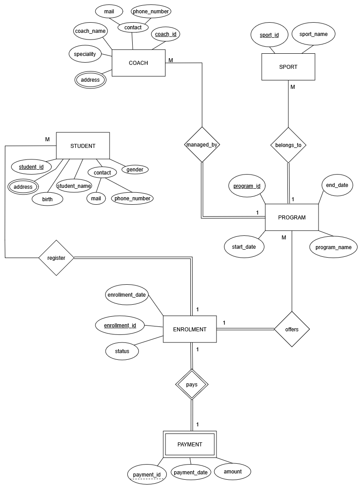
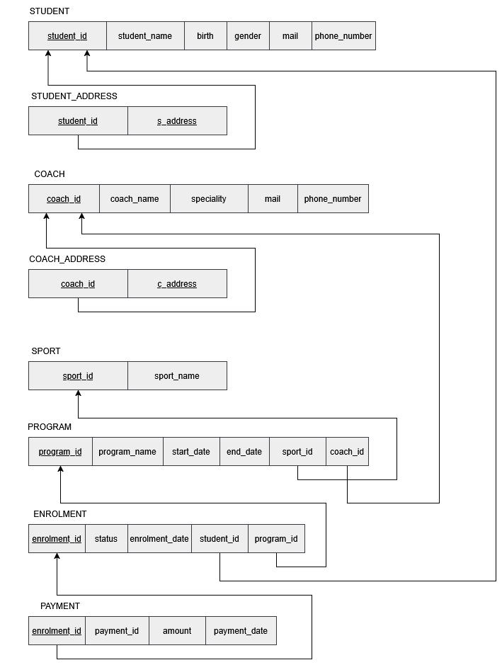

# AthletiCore: Sports Academy Database Management System 🏋️‍♂️🏊

## 📌 Project Overview

AthletiCore is a comprehensive relational database management system developed as a Database Management course project. It is designed to digitize and streamline the core operations of a sports academy, managing student enrollments, coach assignments, training programs, and payment tracking efficiently.

**Project Team:** Caner ALACALI, Beraat Can VARLI, Ayşenur DİKİLİDAŞ

## 🎯 Business Requirements

The business requirements were determined through one-to-one interviews with coaches at the sports academy and meetings with the consultant faculty member. Key goals include:

- Centralized management of student and coach information.
- Tracking students' registration info, sports they participate in, their classes and their relationship with the responsible coaches.
- Managing each academic term's schedule, including class times and responsible coaches.
- Ensuring the system is scalable to support a growing number of students and minimizes manual paperwork.

## 🏗️ Database Architecture & Relationships

The database consists of interconnected tables with carefully defined relationships:

- **Coach ↔ Program (1:N):** A program is managed by one coach, but a coach may manage multiple programs.
- **Sport ↔ Program (1:N):** A sport can have multiple programs, but each program focuses on only one sport.
- **Student ↔ Enrollment (1:N):** A student can enroll in multiple programs.
- **Enrollment ↔ Payment (1:1):** An enrollment can have only one payment. Since payment depends on enrollment, it acts as a weak entity with an identifying relationship.

### ER Diagram & Relational Mapping
*(See the `docs/` folder for original `.drawio` files and the full project report)*

  

  

## ⚙️ Normalization Process (1NF to 3NF)

Initially, the `coach` and `student` tables contained multiple addresses per person, violating the First Normal Form (1NF). To resolve this:

- Separate `coach_address` and `student_address` tables were created.
- The final database architecture conforms to all forms of normalization (1NF, 2NF and 3NF), ensuring no repeating groups, partial dependencies, or transitive dependencies exist.

## 🗂️ Repository Structure

To make this project easy to navigate, the SQL scripts and documentation are organized as follows:

- `docs/`: Contains the original `.drawio` source files, high-resolution images of the ER diagram and relational mapping, and the comprehensive PDF project report.
- `scripts/`:
  - `01_schema.sql`: DDL scripts for creating normalized tables and foreign key constraints.
  - `02_data_seed.sql`: DML scripts containing mock data for testing.
  - `03_business_queries.sql`: 15 complex business logic queries (e.g., revenue calculation, student-program relationships).
- `backup/`: Contains the original, full `.sql` database dump.

